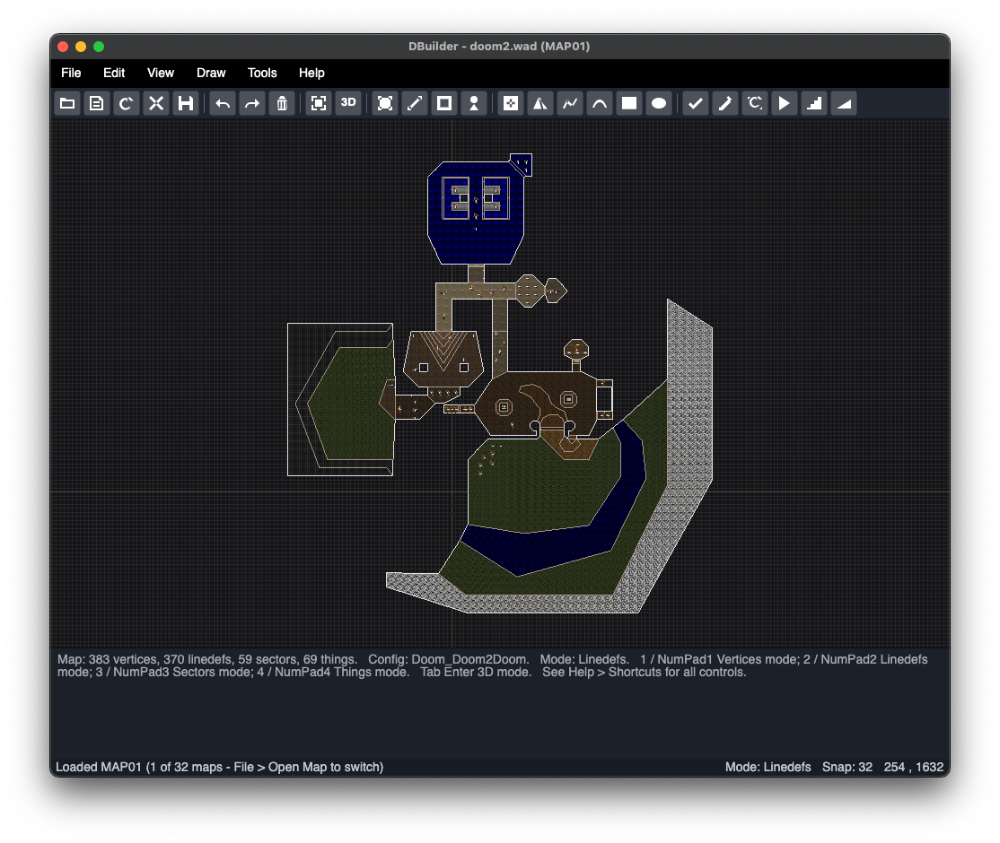
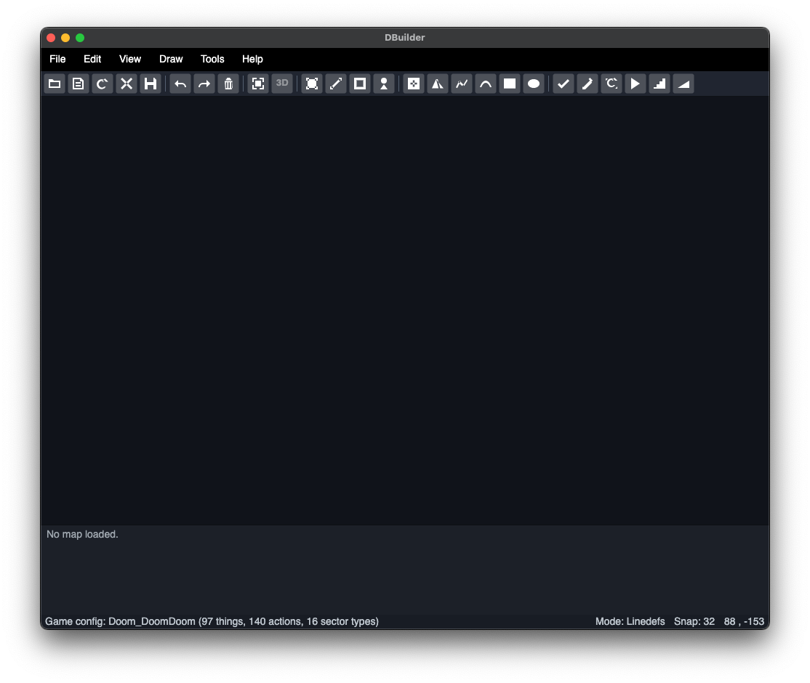

# DBuilder

DBuilder is a modern .NET port of Ultimate Doom Builder focused on cross-platform editor parity. The current application is an Avalonia editor shell with WAD and PK3 loading, map IO, resource loading, game configuration parsing, 2D editing workflows, early 3D support, and focused parser and runtime coverage for UDB behavior.



## Current State

This repository is an active port, not a finished replacement for Ultimate Doom Builder. The codebase is kept working after each slice while parity is built up incrementally.

The authoritative trackers are:

- [docs/TODO.md](docs/TODO.md): remaining work and completed parity slices.
- [docs/PARITY_MATRIX.md](docs/PARITY_MATRIX.md): current DBuilder coverage by UDB source area.
- [docs/FEATURE_SUPPORT.md](docs/FEATURE_SUPPORT.md): current supported and unsupported feature summary.
- [docs/PHASED_PLAN.md](docs/PHASED_PLAN.md): sequencing plan for the port.
- [docs/ARCHITECTURE.md](docs/ARCHITECTURE.md): project map and verification policy.
- [docs/MAP_IO_AND_RESOURCES.md](docs/MAP_IO_AND_RESOURCES.md): map IO and resource loading behavior.
- [docs/RENDERING.md](docs/RENDERING.md): current renderer and shader compiler replacement baseline.
- [docs/PLATFORMS_AND_TOOLS.md](docs/PLATFORMS_AND_TOOLS.md): supported OS targets and external tool discovery rules.
- [docs/MIGRATION.md](docs/MIGRATION.md): current migration guidance for Ultimate Doom Builder users.
- [docs/PLUGIN_API.md](docs/PLUGIN_API.md): current plugin host API model and limits.
- [docs/DEVELOPMENT_PROCESS.md](docs/DEVELOPMENT_PROCESS.md): testing, contribution, manual QA, and release process.
- [docs/UPDATE_POLICY.md](docs/UPDATE_POLICY.md): update behavior for development builds.

When visible editor behavior changes, replace the screenshots in `assets` and update this README alongside `docs/TODO.md` so the repo baseline stays current.

## Screenshots

The README screenshots use the checked-in images under `assets`. Replace those files when visible editor behavior changes, then update this README and `docs/TODO.md` in the same slice.

### Loaded Map


### Empty Editor



## Requirements

- .NET 8 target framework.
- A recent .NET SDK. The current local baseline uses .NET SDK 10.0.107.
- Ultimate Doom Builder checked out locally at `~/dev/repos/UltimateDoomBuilder` for parity comparison and bundled configuration assets.

## License

DBuilder is licensed under the GNU General Public License version 3. The checked-in [LICENSE.txt](LICENSE.txt) matches Ultimate Doom Builder's GPL-3.0 license text byte-for-byte, and .NET build metadata packages that same license file. Source files ported from Ultimate Doom Builder retain their upstream copyright and license notices.

## Build And Verify

Use the repository verification script before committing parity work:

```bash
bash scripts/verify.sh
```

For a narrower editor build:

```bash
dotnet build src/DBuilder.Editor/DBuilder.Editor.csproj
```

Run the editor:

```bash
dotnet run --project src/DBuilder.Editor/DBuilder.Editor.csproj
```

## Development Workflow

Work in small UDB-backed slices:

1. Pick the next viable item from [docs/TODO.md](docs/TODO.md).
2. Compare the relevant behavior against the local UDB clone.
3. Add focused tests for the behavior.
4. Implement the narrowest matching change.
5. Run focused tests and `bash scripts/verify.sh`.
6. Update [docs/TODO.md](docs/TODO.md) and related docs.
7. Commit the verified slice.

Avoid unrelated refactors during parity slices. If a gap is discovered but is not part of the current slice, record it in the TODO or parity docs instead of folding it into the active change.

## Project Layout

- `src/DBuilder.Editor`: Avalonia editor shell and UI workflows.
- `src/DBuilder.IO`: WAD, PK3, map IO, resources, game configuration, and ZDoom data parsers.
- `src/DBuilder.Map`: map model, editing helpers, selection, querying, and geometry-adjacent map behavior.
- `src/DBuilder.Geometry`: shared geometry primitives and helpers.
- `src/DBuilder.Rendering`: Silk.NET rendering support.
- `rust`: Cargo workspace for the in-progress Rust port (see the Rust Port section of `docs/TODO.md`).
- `tests/DBuilder.Tests`: regression suite for ported behavior.
- `docs`: parity plans, architecture notes, and update policy.
- `assets`: README screenshots and visual repo assets.
